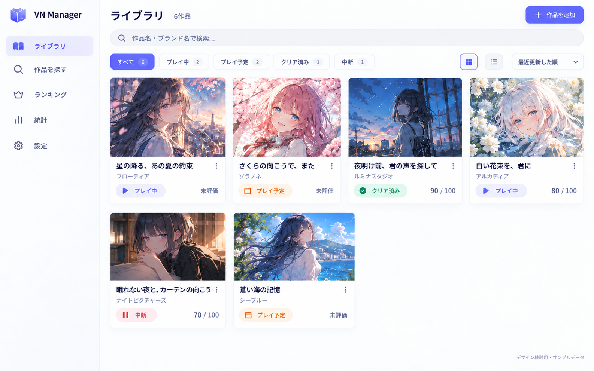
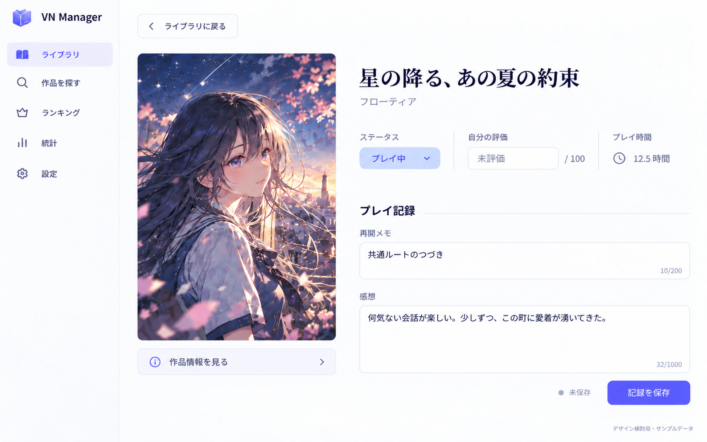

# UI v2 — 実装の入口

2026-10-03 / 準備基準: 89b2b3294ff2c78eebfb9402f899b65c26824044

## 採用した方向

プレイ状況や感想を気軽に記録する、表紙が主役の個人ライブラリ。
ユーザーが採用した構成は「A案のカード一覧 → C案を基にした記録用のライブラリ詳細」。
白とラベンダーの明るい面、読みやすい日本語、穏やかな紫の操作色を全画面で共有する。

一覧で作品を探し、カードを押して詳細へ進み、詳細で記録する。記録フォームを一覧へ埋め込まない。
挨拶、大型おすすめバナー、宣伝枠、未実装のナビゲーションは作らない。

## 最初に読むもの

1. [仕様](SPEC.md) — 配置、トークン、スマホ、全画面の振る舞い、保存とデータ互換性。
2. [実装手順と委任文](HANDOFF.md) — develop-v2へのPR、検証、レビュー、公開条件。
3. [作業一覧](PLAN.md) — 1 Issue / 1 PRの作業順と依存関係。
4. 担当するtickets/V2-XX.mdと、対応するGitHub Issue。
5. CONTRIBUTING.md、ルートのAGENTS.md、対象の最新コード。

v2の画面仕様はSPEC.mdを正本とする。ルートdesign.mdの旧ダーク仕様をv2へ混ぜない。
資料はmainに存在しても、新UIの実装先・PRの統合先はdevelop-v2。
本番公開・mainへの新UIのマージは別途ユーザーが判断する。

## 採用画像

### ライブラリ

### ライブラリ詳細

画像はImageGenで作成した検討用のコンセプト。表紙・タイトル・数字・記録は架空のサンプル。
画像をページ背景に貼ってUIを再現しない。実際のVNDB情報と既存のReactコンポーネントで実装する。
画像にない所有状況、メモ、日付、購入先、本棚等も消してよいという意味ではない。
カードの表紙比率、画像なし、画像ぼかし、フォームの状態、スマホの配置はSPEC.mdが優先する。
画像中の感想の1000字上限は生成上の表現であり、実装へ新しい文字数制限を持ち込まない。

[画面遷移の試作](references/index.html)はローカルで開くHTML。先頭カードと戻るのみ操作でき、入力・保存は画像。
localhostのリンク、参照チャットへのアクセス、Figmaアカウントがなくてもこのフォルダーだけで実装できる。
[画像の制作履歴・プロンプト](references/PROVENANCE.md)。

## 決定したことと、まだ実装していないこと

PCの2画面の方向はユーザー確認済み。スマホ、各状態、他の画面への展開は、その方向を実装できるよう今回SPEC.mdで具体化した。
資料の追加はアプリのUI、IndexedDB、保存形式、依存パッケージを変更しない。
現在の本番は引き続き既存UI。ライト/ダーク切替や新機能の追加はこの改修に含めない。

## GitHub

[UI v2のIssue一覧](https://github.com/neco75/vn-manager/issues?q=is%3Aissue+%22%5Bv2%5D%22)。
親Issueが実際のIssue番号、依存関係、進捗、段階確認の正本。PLAN.mdのV2-XXと各タイトルで対応する。

