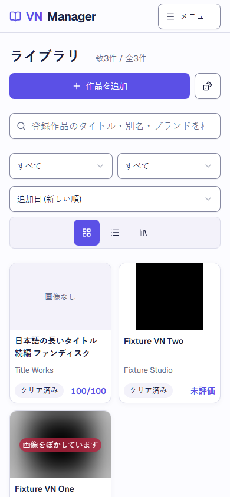
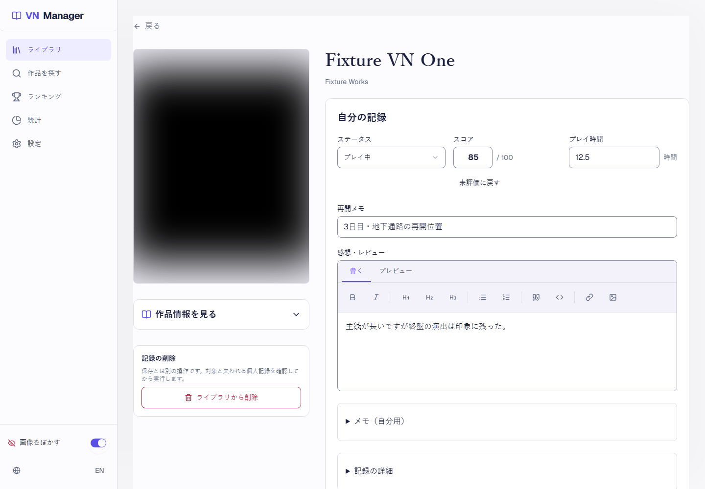
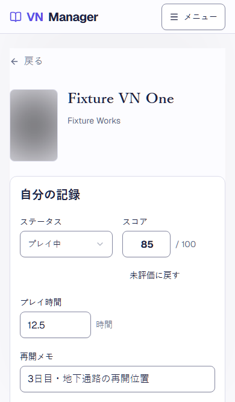

# V2-14 回帰・公開前確認

## 判定

- 検証対象base: `origin/develop-v2` / `e5f0407b954279de04d88c6ee47e6657cb656752`。PR #125（#54の下書き復元E2E、merge `8140fcaa93f20839688169180b3bd6cfa6c72cd0`）とPR #126（#53のアクセシビリティ修正、merge `e5f0407b954279de04d88c6ee47e6657cb656752`）を含む。
- 最新の統合後Quality checks run [37779030863](https://github.com/neco75/vn-manager/actions/runs/37779030863) は2026-10-08 12:57:54 UTCにsuccess。headはbase SHAと同じ`e5f0407b954279de04d88c6ee47e6657cb656752`、unit 98件 / E2E 114件、audit high以上0件（moderate 2件）。
- base SHA `e5f0407` のPreview deployment [6935858523](https://github.com/neco75/vn-manager/deployments/6935858523) はenvironment `Preview` / head `e5f0407b954279de04d88c6ee47e6657cb656752` / status `success`。URLは[こちら](https://vn-manager-jotpftwe0-neco75s-projects.vercel.app)。
- 最新に完了した `CI=1 npm run check:review` はPR #126 head `1677fffef91e31c5e973324b6474c417b55a1e5a`で成功。GitHub run [37778238399](https://github.com/neco75/vn-manager/actions/runs/37778238399)はsuccess、unit 98件、E2E 114件、audit high以上0件（moderate 2件）。
- このPRはQA資料と画面証跡のみを更新する。アプリ本体、DB、依存パッケージ、保存形式の変更はない。Playwrightは既存VNDB fixtureと隔離BrowserContextを使い、実データ・実VNDBへ接続しない。

## 採用画面と実画面

親Issue #76 の[2026-10-07確認コメント](https://github.com/neco75/vn-manager/issues/76#issuecomment-6036035422)には、PR #108統合後のPreview画面とPC/スマホ画像をユーザーへ提示し、「ok」の返答を受けたとある。これは第1段階の一覧→詳細→保存→戻るを次へ進める確認。今回も認証付きPreviewの手動操作はVercel認証が `account_not_found` となり未確認で、ユーザーの実ブラウザや実データを使った操作はしていない。

採用したコンセプトは画面の方向を示す架空の6作品モック。実UIは保存済みレコードと既存機能を表示するため内容と補助操作が異なる。既存の状態・所有フィルター、12種の並べ替え、grid/list/shelf、件数、ルーレットは仕様に沿って維持している。E2E画像は架空fixtureを使うため、VNDB実作品の表紙画像とは異なる。

| 採用画像 | 実UIとの差 | 理由 |
| --- | --- | --- |
| [一覧案](references/library.png) | コンセプトは6作品のイラストと単一の状態列。実画面はfixtureの3作品、状態と所有の選択、並べ替え、3つの表示形式、検索一致件数を表示する。 | 実保存データとSPECの既存操作を維持するため。表紙なしの長い日本語タイトル、画像ぼかし、0点、未評価のfixtureを含む。 |
| [詳細案](references/detail.png) | コンセプトは大きな架空表紙、状態/評価/時間、再開メモと感想。実画面は保存済み作品の2列記録配置で、所有・日付・購入先・非公開メモ・削除確認も維持し、編集中のみ保存バーを出す。 | 既存LibraryItemの全項目と操作を保持し、追加機能や情報を画像から新設しないため。 |

### 実画面

PC 1440×1000の一覧画像はPR #126統合後の画面を既存Playwright fixtureで再取得した。状態フィルターがTab列からラベル付きボタングループになり、ボタン幅に合わせて行の配置が変わる。スマホ390×844の一覧は状態Selectを使うため、この変更の影響を受けず、詳細390×667と編集中の保存バー画像も#125/#126の変更対象ではない。これらの既存画像は現状を代表している。

## 仕様マトリクスと操作

| 項目 | 確認根拠 |
| --- | --- |
| 幅320/390/768/1024/1440px | `e2e/final-qa.spec.ts` の主要導線と横overflow、`e2e/v2-09-search-add.spec.ts` のカード列数、`e2e/issue-54-record-ux.spec.ts` の詳細、`e2e/shell-navigation.spec.ts` とranking/shelfのresponsive E2E。5幅すべてを複数画面で実行。 |
| JA/EN | `e2e/issue-53-accessibility.spec.ts`、`e2e/v2-09-search-add.spec.ts`、`e2e/ranking-and-shelf-responsive.spec.ts`。背景画像あり/なしと白/黒背景も含む。 |
| 長いタイトル・表紙なし・ぼかし | `e2e/search-and-library.spec.ts`、`e2e/ranking-and-shelf-responsive.spec.ts`、`e2e/issue-53-accessibility.spec.ts`。fixtureの長いJA/ENタイトル、画像なし、性的内容値が未知の画像も対象。 |
| 正常・空・失敗 | `e2e/search-and-library.spec.ts`、`e2e/v2-09-search-add.spec.ts`、`e2e/v2-10-ranking.spec.ts`、`e2e/v2-11-stats.spec.ts`、`e2e/v2-13-backup.spec.ts`、`e2e/issue-55-idb-retry.spec.ts`。空、絞り込み0件、通信失敗、DB失敗、再試行後を区別。 |
| 背景 on/off | `e2e/final-qa.spec.ts` と `e2e/issue-53-accessibility.spec.ts`。白/黒/背景なし、画像ぼかしの切替を確認。 |
| 操作・focus・44px | `e2e/issue-53-accessibility.spec.ts`、`e2e/shell-navigation.spec.ts`、`e2e/final-qa.spec.ts`。キーボード導線、Dialog focus trap/復帰、スコアと未評価、保存、追加/削除を確認。 |
| 状態フィルターとランキング見出し | `e2e/issue-53-accessibility.spec.ts` がPC状態グループのJA/EN名、選択ボタンの`aria-pressed`、左右矢印での選択とTab移動、44px以上の操作高を確認。ランキングはH1に続く作品名をH2として確認。モバイルは既存Selectを維持。 |
| 文字・境界・focusのcontrast | `e2e/issue-53-accessibility.spec.ts` が実computed colorで通常文字/placeholder 4.5:1以上、入力境界と操作表面3:1以上を確認。disabled操作は対象外。 |
| 横overflow・保存バー | `e2e/final-qa.spec.ts` と `e2e/detail-save-bar.spec.ts`。編集長文、画面端/固定位置、入力とheader/保存バーの重なり、ポインターとキーボード保存を確認。390×667/844の画像も収録。 |

### PR #126修正後の限定Axe確認

PR #126 Preview head `1677fffef91e31c5e973324b6474c417b55a1e5a`のdeployment [6935698201](https://github.com/neco75/vn-manager/deployments/6935698201)（environment `Preview` / status `success`）に対し、統合担当がAxe 4.11を独立に実行した。対象は`/` desktop JA、`/` desktop EN、`/ranking` desktop ENの3条件。`aria-valid-attr-value`と`heading-order`の違反は、各条件で0件だった。

これは限定した3条件の走査結果であり、全72条件を修正後に再走査した結果ではない。PR #126本文にある72条件の手動Axe確認は修正前の結果である。

## 保存互換性と障害復旧

- `e2e/v2-13-backup.spec.ts` はフォーム保存→再読込→JSON export→別BrowserContextへrestoreを同一テストで実行。exportと復元後を元LibraryItemと完全一致比較する。
- 2件のfixtureでscore `0`、`null`/未評価、750分、各日付、status/ownership、メモ/感想/再開メモ、購入先、addedAt/updatedAt、VN metadataを含む。設定3キーも復元後のlocalStorageと再読込後で確認。
- PR #125は`e2e/issue-54-record-ux.spec.ts`に下書き復元E2Eを追加。`status` / `ownership` / `score` / `notes` / `review` / `playTime` / `purchaseLocation` / `startedOn` / `completedOn` / `lastPlayedOn` / `resumeNote`の11項目を編集し、保存せず画面を離れて再訪した後に復元する。復元前後のフォーム値と「下書き保存済み・記録には未反映」を確認し、離脱前・離脱後・復元後のIndexedDB本記録が元のまま保たれることも照合する。
- 保存形式は現行のまま: IndexedDB `vn-manager-db` / DB version `3`、LibraryItem `recordVersion: 2`、backup schema `2`、draft localStorage key `vn-manager-detail-draft-v1:<vnId>` / draft version `1`。下書きの復元/破棄・別作品分離・別tab競合は `e2e/search-and-library.spec.ts`、`e2e/save-conflicts.spec.ts`、`test/unit/detail-draft.test.ts` が確認。
- `e2e/issue-55-idb-retry.spec.ts` はopen初回失敗、再試行の連続失敗、次の再試行で復旧し、保存fieldsと750分を含む詳細値が戻ることを確認。未処理Promise rejectionが0であることも確認。修正はPR #117でbaseへ統合済み。

### 実行結果

- PR #126 head上で `CI=1 npm run check:review` がexit 0。regression checks、unit 98/98、lint、typecheck、build、E2E 114/114、`npm audit --audit-level=high`を完走した。auditはmoderate 2件、high以上0件。
- PlaywrightはCI設定の1 workerで114件を実行。Issue #55の3ケース、Issue #54の下書き11項目、backupの別BrowserContext往復、下書き/別tab競合、Settingsのbackup fingerprint成功・失敗・変更検知、responsive/JA/EN/a11yケースを含む。
- 統合後のdevelop-v2 Quality checks run [37779030863](https://github.com/neco75/vn-manager/actions/runs/37779030863) はsuccess。unit 98/98、E2E 114/114、audit high以上0件（moderate 2件）。

## Preview、本番境界、rollback

- develop-v2 head `e5f0407b954279de04d88c6ee47e6657cb656752`のVercel deployment [6935858523](https://github.com/neco75/vn-manager/deployments/6935858523) はenvironment `Preview` / head SHA一致 / status `success`。URLは[こちら](https://vn-manager-jotpftwe0-neco75s-projects.vercel.app)。
- 現在の`main` headは`5ae97970b2386b740a168b7e137df246f1fc542f`。確認できた最新Production deployment [6913928333](https://github.com/neco75/vn-manager/deployments/6913928333) も同SHAで、GitHub deployment environment `Production` / status `success`。このPRからmain、Production deployment、promoteは変更しない。
- Vercel認証が`account_not_found`となるため、認証付きPreviewの手動操作とVercel dashboard上のProduction Branch設定は未確認。Previewのデプロイ成功やローカルE2Eをこれらの代わりに扱わない。

## ローカル検証結果

| Check | 結果 |
| --- | --- |
| `npm ci` | exit 0。package/lockfileの差分なし。moderate 2件を報告。 |
| `npm run build` | exit 0。 |
| `npx playwright test e2e/search-and-library.spec.ts --grep "keeps long library cards readable and makes the whole card a detail link at 320px" --workers=1` | 1件成功。PC1440×1000、390×844、390×667の一覧画像を既存fixtureで生成。コミット差分はPC一覧画像のみ。 |
| 最新成功 `check:review` | PR #126 head `1677fffef91e31c5e973324b6474c417b55a1e5a`、run [37778238399](https://github.com/neco75/vn-manager/actions/runs/37778238399) success。unit 98 / E2E 114。 |
| develop-v2 post-merge Quality checks | run [37779030863](https://github.com/neco75/vn-manager/actions/runs/37779030863)、head `e5f0407b954279de04d88c6ee47e6657cb656752`、success。unit 98 / E2E 114 / audit high以上0（moderate 2）。 |
| develop-v2 Preview | deployment [6935858523](https://github.com/neco75/vn-manager/deployments/6935858523)、environment `Preview`、head `e5f0407b954279de04d88c6ee47e6657cb656752`、status `success`。 |

## 未確認

- 認証されたVercel Previewでのライブ手動操作とVercel dashboardのProduction Branch設定。認証が`account_not_found`。GitHub deployment statusは確認済みだが、live手動操作やProduction Branch画面確認の代替とは扱わない。
- VNDB実データ/実表紙の描画。すべてのE2Eはfixtureとネットワーク遮断を使った。
