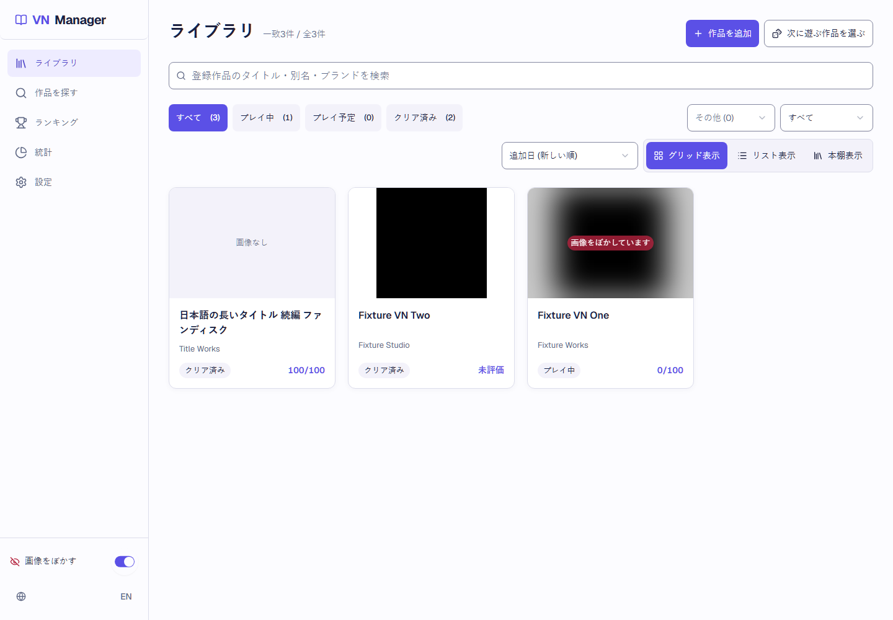
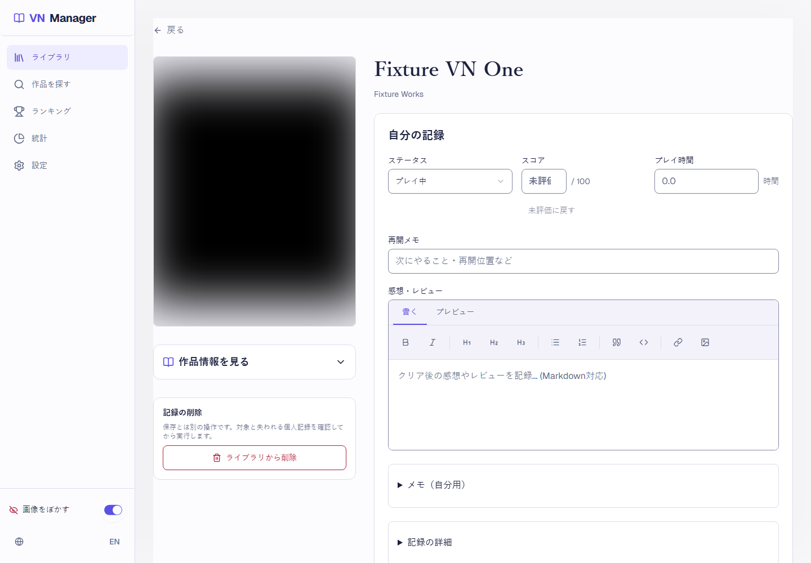
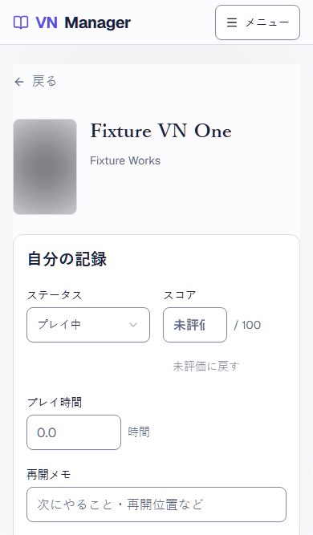
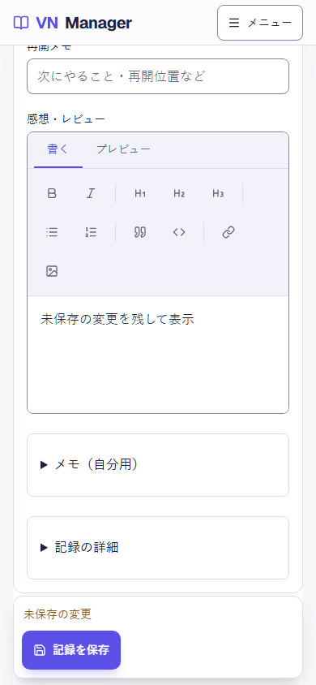

# V2-14 回帰・公開前確認

## 判定

- 検証対象base: `origin/develop-v2` / `408fd3f7161be94bbed0a8e7b140bcb67a3705bb`（PR #117 merge、#55修正を含む）。
- このPRのhead: PRの最新head SHAを参照。アプリ本体、DB、依存パッケージ、保存形式の変更はない。
- PR #89 / #113 は `b14ee708f49751698eeab5bb4c53a4816abc9f1f` に統合済み。親Issue #76で確認。
- PR #117 の統合後Quality checks run [37647946353](https://github.com/neco75/vn-manager/actions/runs/37647946353) は `408fd3f` で成功。PR #117 のPreviewも成功。
- ローカル `npm run check:review`: 下記の結果を参照。PlaywrightはVNDB fixtureと隔離BrowserContextを使い、実データ・実VNDBへ接続しない。

## 採用画面と実画面

親Issue #76 の[2026-10-07確認コメント](https://github.com/neco75/vn-manager/issues/76#issuecomment-6036035422)には、PR #108統合後のPreview画面とPC/スマホ画像をユーザーへ提示し、「ok」の返答を受けたとある。これは第1段階の一覧→詳細→保存→戻るを次へ進める確認。Previewの手動操作はVercel認証が `account_not_found` となり未確認だった。今回もユーザーの実ブラウザや実データを使った操作はしていない。

採用したコンセプトは画面の方向を示す架空の6作品モック。実UIは保存済みレコードと既存機能を表示するため内容と補助操作が異なる。既存の状態・所有フィルター、12種の並べ替え、grid/list/shelf、件数、ルーレットは仕様に沿って維持している。E2E画像は架空fixtureを使うため、VNDB実作品の表紙画像とは異なる。

| 採用画像 | 実UIとの差 | 理由 |
| --- | --- | --- |
| [一覧案](references/library.png) | コンセプトは6作品のイラストと単一の状態列。実画面はfixtureの3作品、状態と所有の選択、並べ替え、3つの表示形式、検索一致件数を表示する。 | 実保存データとSPECの既存操作を維持するため。表紙なしの長い日本語タイトル、画像ぼかし、0点、未評価のfixtureを含む。 |
| [詳細案](references/detail.png) | コンセプトは大きな架空表紙、状態/評価/時間、再開メモと感想。実画面は保存済み作品の2列記録配置で、所有・日付・購入先・非公開メモ・削除確認も維持し、編集中のみ保存バーを出す。 | 既存LibraryItemの全項目と操作を保持し、追加機能や情報を画像から新設しないため。 |

### 実画面

PC 1440×1000の一覧と記録フォーム、詳細390×667、スマホ390×844で下部を編集した状態の実画像。390×844ではページ下部へ移動しても保存バーが画面下に残り、保存操作へ届く。

## 仕様マトリクスと操作

| 項目 | 確認根拠 |
| --- | --- |
| 幅320/390/768/1024/1440px | `e2e/final-qa.spec.ts` の主要導線と横overflow、`e2e/v2-09-search-add.spec.ts` のカード列数、`e2e/issue-54-record-ux.spec.ts` の詳細、`e2e/shell-navigation.spec.ts` とranking/shelfのresponsive E2E。5幅すべてを複数画面で実行。 |
| JA/EN | `e2e/issue-53-accessibility.spec.ts`、`e2e/v2-09-search-add.spec.ts`、`e2e/ranking-and-shelf-responsive.spec.ts`。背景画像あり/なしと白/黒背景も含む。 |
| 長いタイトル・表紙なし・ぼかし | `e2e/search-and-library.spec.ts`、`e2e/ranking-and-shelf-responsive.spec.ts`、`e2e/issue-53-accessibility.spec.ts`。fixtureの長いJA/ENタイトル、画像なし、性的内容値が未知の画像も対象。 |
| 正常・空・失敗 | `e2e/search-and-library.spec.ts`、`e2e/v2-09-search-add.spec.ts`、`e2e/v2-10-ranking.spec.ts`、`e2e/v2-11-stats.spec.ts`、`e2e/v2-13-backup.spec.ts`、`e2e/issue-55-idb-retry.spec.ts`。空、絞り込み0件、通信失敗、DB失敗、再試行後を区別。 |
| 背景 on/off | `e2e/final-qa.spec.ts` と `e2e/issue-53-accessibility.spec.ts`。白/黒/背景なし、画像ぼかしの切替を確認。 |
| 操作・focus・44px | `e2e/issue-53-accessibility.spec.ts`、`e2e/shell-navigation.spec.ts`、`e2e/final-qa.spec.ts`。キーボード導線、Dialog focus trap/復帰、スコアと未評価、保存、追加/削除を確認。 |
| 文字・境界・focusのcontrast | `e2e/issue-53-accessibility.spec.ts` が実computed colorで通常文字/placeholder 4.5:1以上、入力境界と操作表面3:1以上を確認。disabled操作は対象外。 |
| 横overflow・保存バー | `e2e/final-qa.spec.ts` と `e2e/detail-save-bar.spec.ts`。編集長文、画面端/固定位置、入力とheader/保存バーの重なり、ポインターとキーボード保存を確認。390×667/844の画像も収録。 |

## 保存互換性と障害復旧

- `e2e/v2-13-backup.spec.ts` はフォーム保存→再読込→JSON export→別BrowserContextへrestoreを同一テストで実行。exportと復元後を元LibraryItemと完全一致比較する。
- 2件のfixtureでscore `0`、`null`/未評価、750分、各日付、status/ownership、メモ/感想/再開メモ、購入先、addedAt/updatedAt、VN metadataを含む。設定3キーも復元後のlocalStorageと再読込後で確認。
- 保存形式は現行のまま: IndexedDB `vn-manager-db` / DB version `3`、LibraryItem `recordVersion: 2`、backup schema `2`、draft localStorage key `vn-manager-detail-draft-v1:<vnId>` / draft version `1`。下書きの復元/破棄・別作品分離・別tab競合は `e2e/search-and-library.spec.ts`、`e2e/save-conflicts.spec.ts`、`test/unit/detail-draft.test.ts` が確認。
- `e2e/issue-55-idb-retry.spec.ts` はopen初回失敗、再試行の連続失敗、次の再試行で復旧し、保存fieldsと750分を含む詳細値が戻ることを確認。未処理Promise rejectionが0であることも確認。修正はPR #117でbaseへ統合済み。

### 基準branch比較

- 変更branchの通常6-worker `npm run check:review` は108/109 E2Eで、未変更の `e2e/final-qa.spec.ts` 初回導線がメモ入力の30秒timeoutで1回失敗した。同test単体は1/1 pass、CI設定の1-worker全109件もpassした。
- 比較のため `origin/develop-v2` / `408fd3f` のclean worktreeで `npm run test:e2e` を6-worker実行。107/109 passで、変更前からある `e2e/issue-54-record-ux.spec.ts` のキャンセル後文言assertionと `e2e/settings.spec.ts` の重複toast locator strict violationが同じく失敗。`final-qa` 初回導線は4.1秒でpassした。
- したがって通常実行の単発timeoutはbaseで再現せず、serial CIと単体でも再現していない。対象spec自体もbaseとの差分なし。6-worker負荷下の断続的timeoutと判断し、最小修正を加えず記録した。baseとの差が出た2件のみそれぞれ正しい現行文言と新しいtoast発生を判定するようE2E assertionを直した。

## Preview、本番境界、rollback

- GitHub DeploymentsのVercel記録で `408fd3f` のdeployment [6914497828](https://github.com/neco75/vn-manager/deployments/6914497828) は環境 `Preview`、status `success`。Preview URLは[こちら](https://vn-manager-c163zgefu-neco75s-projects.vercel.app)。
- 最新Production deployment [6913928333](https://github.com/neco75/vn-manager/deployments/6913928333) は `5ae97970b2386b740a168b7e137df246f1fc542f`（main）。`develop-v2`の新UIはProductionに出ていない。Vercel dashboardのProduction Branch設定画面は直接確認できていないため、設定自体は未確認。
- 公開前のコードrollback元はProduction SHA `5ae97970b2386b740a168b7e137df246f1fc542f`。このPRはE2E/verification資料/検証画像のみで、保存形式への影響なし。Production deploy/promote/mainへのUI公開は実施していない。

## ローカル検証結果

| Check | 結果 |
| --- | --- |
| `npm ci` | 成功。既存Moderate audit 2件。 |
| `CI=true npm run check:review` | exit 0。Regression / unit 93/93 / lint / typecheck / E2E 109/109 pass。`npm audit --audit-level=high` はModerate 2件のみで閾値未満。 |
| 通常6-worker `npm run check:review` | exit 1、E2E 108/109。baseで再現しない `final-qa` 初回導線が30秒timeout。同test単体とCI設定全件ではpass。上の基準branch比較を参照。 |
| 基準 `origin/develop-v2` 6-worker `npm run test:e2e` | exit 1、107/109。変更前からあるIssue #54文言assertionとsettings duplicate-toast locatorの2件。`final-qa` 初回導線はpass。 |
| post-merge Quality checks | success、run `37647946353`、head `408fd3f7161be94bbed0a8e7b140bcb67a3705bb`。 |
| PR Quality checks / Preview | このIssue PR作成後に追記する。 |

## 未確認

- 認証されたVercel Previewでのライブ手動操作とVercel dashboardのProduction Branch設定。親Issue #76の記録ではPreviewの認証が `account_not_found`。ローカルE2EとGitHub deployment statusは確認済みだが、これをlive手動操作の代替とは扱わない。
- VNDB実データ/実表紙の描画。すべてのE2Eはfixtureとネットワーク遮断を使った。
